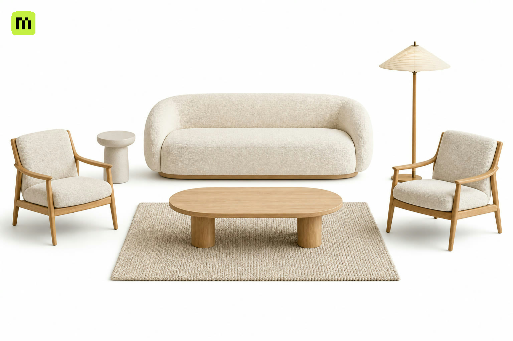

# Mint for Pascal

<p align="center">
  
</p>

Generate, browse, and add Mint 3D assets in Pascal Editor.

## What you can do

- Sign in with your Mint account.
- Browse your Mint 3D asset library.
- Generate models from a prompt or reference image.
- Optimize models and add them to your Pascal scene.

## Add Mint to Pascal

Pascal maintainers can follow the [integration guide](./HOST_INTEGRATION.md) to
install the plugin and connect it to the editor.

Supports Pascal `1.0.0-beta.3`, `1.0.0-beta.1`, and `0.9.2`.

## Development

```bash
pnpm --filter @mint/pascal-plugin compatibility
pnpm --filter @mint/pascal-plugin type-check
pnpm --filter @mint/pascal-plugin test
```

## Releases

See the [changelog](./CHANGELOG.md) for each version's updates.

MIT licensed.
